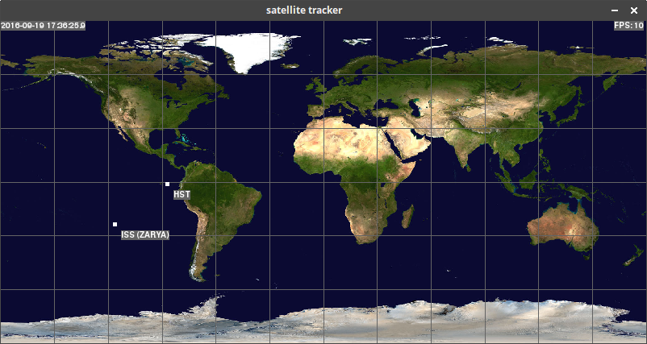

# satellite-tracker

a simple satellite tracker inspired by [gpredict][1] written in python (2.7)

it uses NORAD two line elements (TLE) from [celestrack.com][2] 
and [python-sgp4][3] to predict satellite positions. 

[pygame][4] is used to display the map and [arrow][5] is used for time keeping

to run:

        cd tracker/
	python tracker.py

## installation

	sudo apt install python-pygame
	pip install -r requirements.txt

## TODO

- change from spherical earth to a more accurate representation
- optimizations
- 3d view
	
[1]: http://gpredict.oz9aec.net/
[2]: http://celestrak.com/SpaceTrack/
[3]: https://pypi.python.org/pypi/sgp4/
[4]: http://pygame.org
[5]: https://github.com/crsmithdev/arrow

